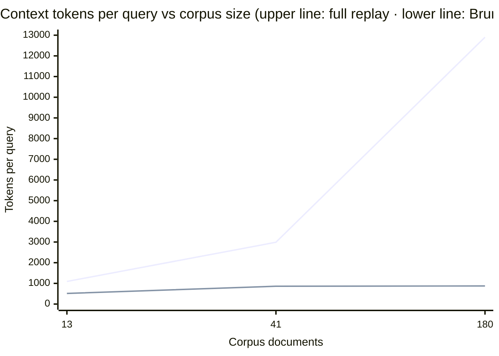

<!-- SPDX-License-Identifier: Apache-2.0 -->

# Brunnr Retrieval Benchmark

This benchmark measures Brunnr's retrieval path against anonymized corpora of increasing size and
reports the token cost, precision, and recall of each retrieval strategy. It is fully reproducible
(`just bench-check`).

## Methodology

The harness indexes a corpus's `memory/` and `distractors/` directories together through the real
`mimisbrunnr::backfill_directory` path into `SqliteVecVectorStore`, then calls
`VectorMemoryBackend.find` for each retrieval arm. The retriever sees one undifferentiated corpus;
`tasks.json` `relevant_docs` is used only *after* retrieval, to score precision and recall. Success
for a task means its relevant source document(s) appear in the retrieved set.

Three corpus tiers run the **identical** harness so the effect of corpus size is visible:

| Tier | Size | Source |
|---|---|---|
| `seed-corpus/` | 13 docs, 8 tasks | hand-authored prose |
| `large-corpus/` | 41 docs, 20 tasks | hand-authored prose with plausible near-miss distractors |
| `xl-corpus/` | 180 docs, 40 tasks | procedurally generated distinct facts (`tools/generate_xl_corpus.py`, fixed seed) |

Assumptions:

- Backend: `SqliteVecVectorStore` via `VectorMemoryBackend`.
- Embedding model: `intfloat/multilingual-e5-small`, 384 dimensions.
- Hybrid retrieval: SQLite FTS/BM25 + dense vector search fused with RRF, followed by the local
  lexical reranker where the arm enables it.
- Tokenizer: `cl100k_base` via `tiktoken-rs` (model-tokenizer counts, not whitespace counts).

Retrieval strategies (arms), varied one at a time:

- **A — full replay**: the whole corpus in context (baseline).
- **B — Brunnr default**: a compact index slice + `memory.find` top-M + local rerank to top-k.
- **C — built-in memory**: `memory.find` top-1, no index slice, no rerank (weak baseline).
- **B + HyDE / B + multi-query / B + debate / B + reflection-consolidated**: opt-in variants over
  the same backend.
- **D — no memory**: negative control.

(Each A/B arm also has a cold-session variant that differs only by a few metadata tokens; those are
omitted from the tables below and available in the raw results.)

## Results

Brunnr's per-query context cost stays roughly flat as the corpus grows, while full replay scales
with it — so the token saving widens with memory size:

| Corpus | Full replay (tokens/query) | Brunnr (tokens/query) | Saving |
|---|---:|---:|---:|
| 13 docs | 1,093 | 514 | **53%** |
| 41 docs | 2,988 | 861 | **71%** |
| 180 docs | 12,902 | 876 | **93%** |



Brunnr sends an index slice plus a top-k slice regardless of how large the durable memory is, so its
cost barely moves (514 → 861 → 876) while full replay grows ~12×.

### Per-tier detail

**Seed — 13 docs, 8 tasks**

| Arm | Success | Tokens/query | Tokens/success | Precision | Recall |
|---|---:|---:|---:|---:|---:|
| A — full replay | 100% | 1093 | 1093 | 0.07 | 1.00 |
| B — Brunnr default | 87.5% | 514 | 588 | 0.29 | 0.88 |
| B + reflection | 87.5% | 694 | 793 | 0.29 | 0.88 |
| B + debate | 87.5% | 543 | 621 | 0.29 | 0.88 |
| B + multi-query | 87.5% | 552 | 630 | 0.29 | 0.88 |
| B + HyDE | 37.5% | 557 | 1485 | 0.13 | 0.38 |
| C — built-in memory | 62.5% | 129 | 206 | 0.63 | 0.63 |
| D — no memory | 0% | 52 | — | 0.00 | 0.00 |

**Large — 41 docs, 20 tasks**

| Arm | Success | Tokens/query | Tokens/success | Precision | Recall |
|---|---:|---:|---:|---:|---:|
| A — full replay | 100% | 2988 | 2988 | 0.02 | 1.00 |
| B — Brunnr default | 80% | 861 | 1076 | 0.27 | 0.80 |
| B + reflection | 95% | 1059 | 1114 | 0.32 | 0.95 |
| B + debate | 80% | 890 | 1113 | 0.27 | 0.80 |
| B + multi-query | 55% | 905 | 1645 | 0.18 | 0.55 |
| B + HyDE | 45% | 909 | 2020 | 0.15 | 0.45 |
| C — built-in memory | 75% | 120 | 160 | 0.75 | 0.75 |
| D — no memory | 0% | 52 | — | 0.00 | 0.00 |

**XL — 180 docs, 40 tasks**

| Arm | Success | Tokens/query | Tokens/success | Precision | Recall |
|---|---:|---:|---:|---:|---:|
| A — full replay | 100% | 12902 | 12902 | 0.01 | 1.00 |
| B — Brunnr default | 100% | 876 | 876 | 0.33 | 1.00 |
| B + multi-query | 100% | 924 | 924 | 0.33 | 1.00 |
| B + debate | 100% | 907 | 907 | 0.33 | 1.00 |
| B + reflection | 100% | 1253 | 1253 | 0.33 | 1.00 |
| B + HyDE | 57.5% | 914 | 1590 | 0.19 | 0.58 |
| C — built-in memory | 72.5% | 116 | 160 | 0.73 | 0.73 |
| D — no memory | 0% | 54 | — | 0.00 | 0.00 |

The two larger tiers probe different things. **Large** uses semantically overlapping prose, so it
stresses retrieval *difficulty* (recall dips to 0.80). **XL** uses many distinct facts keyed by
unique entity names, isolating the *scaling* variable (recall stays 1.0 while full replay reaches
~13k tokens and Brunnr holds at ~876). Precision 0.33 is the ceiling at top-k=3 with one relevant
document. A weak arm (HyDE) still fails — 57.5% on XL, 37.5–45% on the smaller tiers.

Reading the tables:

- **B (Brunnr default)** is the recommended setting: it cuts tokens/query by 53–93% depending on
  corpus size. A larger corpus is harder to retrieve from (recall dips) but the saving grows — the
  trade-off Brunnr manages.
- **C (built-in, top-1)** is cheapest and most precise but recalls less, so it fails more tasks.
- **Opt-in methods stay off by default.** HyDE and multi-query do not help here; debate is
  token-neutral; reflection-consolidation is the strongest variant on the Large tier (95%) at a
  token premium plus an upfront consolidation cost. Enable one only if a target corpus shows a
  measured gain.
- `Tokens/query` is the context cost (the headline metric). `Tokens/success` also penalizes lower
  success, so low-recall arms look worse there.

## Reproduce

```sh
just bench          # seed tier  -> benchmarks/results/sample-run/
just bench-large    # large tier -> benchmarks/results/large-corpus/
just bench-xl       # xl tier    -> benchmarks/results/xl-corpus/
just bench-check    # rerun all tiers and fail if committed results differ
```

The XL corpus is regenerated deterministically with `python3 benchmarks/tools/generate_xl_corpus.py`
(fixed seed). A live-Qdrant smoke test proves the same retrieval path against `QdrantVectorStore`:
`cargo test -p brunnr-bench --test qdrant -- --ignored` with `QDRANT_URL` set.

Each tier's results directory keeps small, byte-reproducible artifacts: `aggregate.json` (means,
CI95, precision/recall, retrieval misses, per-method verdicts), `summary.csv`, `charts.txt`, and
`checksums.txt`. The bulky `raw.jsonl` (full prompts/traces) and machine-dependent `timing.jsonl`
are gitignored and regenerated on demand.

## Reproducibility and integrity

The harness is built so the numbers cannot be fabricated by construction:

1. `tasks.json` `relevant_docs` is the ground truth and is never passed to the retriever; precision
   and recall are scored only against what `memory.find` actually returns.
2. Retrieval arms call `MemoryBackend.find` (`crates/brunnr-bench/src/main.rs`) — there are no
   hardcoded, label-derived result sets.
3. `just bench-check` reruns every tier and fails if any committed result changes, and
   `aggregate.json` records the per-tier retrieval misses (recall < 1.0), so weak strategies are
   visible rather than hidden.

## Scope and limitations

This benchmark measures retrieval quality and tokenizer footprint, not end-to-end answer quality.
Brunnr helps when a bounded retrieval slice can surface the answer source from a larger durable
context; it does not help if the query is underspecified, the corpus lacks the answer, or the host
agent already retrieves the right document cheaply.
