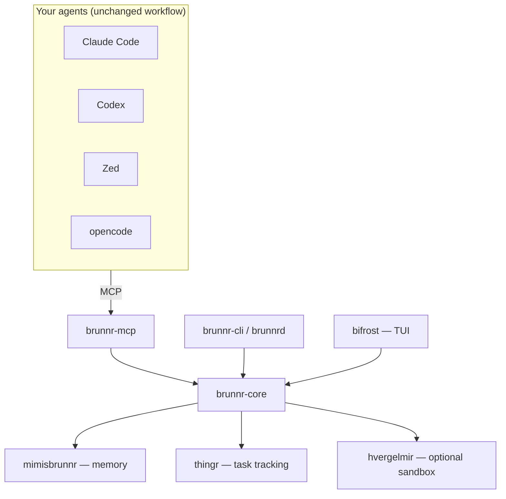

<!-- SPDX-License-Identifier: Apache-2.0 -->

# Architecture

Brunnr is a Cargo workspace with strict crate boundaries. It integrates with agents over **MCP**,
so any MCP-capable tool (Claude Code, Codex, Zed, opencode, …) gains Brunnr's capabilities
without changing how it is driven. Everything is optional and composable via [modes](modes.md).

Crates:

- **`brunnr-core`** — orchestration-neutral primitives: roles (Óðinn/Þórr/Týr with
  master/worker/judge aliases), task-queue types (Erindi/Þing/Galdr), config, modes, and the
  `Agent` adapter trait. Knows nothing about memory storage or process specifics.
- **`mimisbrunnr`** — memory contracts and backends. `FilesBackend` implements `MemoryBackend`
  directly; vector engines implement the thin `VectorStore` trait and `VectorMemoryBackend<V>`
  implements memory semantics once for sqlite-vec, Qdrant, and future stores. See
  [memory.md](memory.md).
- **`brunnr-mcp`** — exposes memory tools (`memory.find`, `memory.store`) over MCP; the seam for
  future task and system tools.
- **`brunnr-cli` / `brunnrd`** — user entrypoint and optional daemon (init, memory ops, spawn).
- **`bifrost`** — TUI. **`hvergelmir`** — optional Docker sandbox. **`thingr`** — task tracking
  ([task-tracking.md](task-tracking.md), planned). **`huginn`** — optional macOS tray.

Engine/agent specifics live behind traits (`VectorStore`, `Agent`, `TaskStore`) so adding a
backend, agent, or tracker is a small adapter, never a core change.
